# Sistema AI Generativo para Reportes Financieros y Análisis Contable

## Descripción

Crear una aplicación web que permita a CFOs y profesionales financieros:
- Cargar datos económicos en formato CSV
- Generar automáticamente informes narrativos (estilo "Estado de Resultados narrado")
- Visualizar KPIs clave con gráficas
- Interactuar mediante un chatbot para consultas financieras en lenguaje natural

## Arquitectura Propuesta

```mermaid
graph TB
    subgraph Frontend ["Frontend (React + Vite)"]
        App["App.jsx - Router Principal"]
        Dashboard["Dashboard"]
        Reports["Reports"]
        Upload["CSV Upload"]
        ChatWidget["Chat Widget 💬"]
    end
    
    subgraph Components ["Componentes Principales"]
        KPICards["KPI Cards"]
        Charts["Gráficas"]
        NarrativeReport["Reporte Narrativo"]
        FileUpload["Upload CSV"]
    end
    
    Dashboard --> KPICards
    Dashboard --> Charts
    Dashboard --> NarrativeReport
    Reports --> FileUpload
    
    ChatWidget -->|API| Backend["Backend API :8000"]
```



---

## Proposed Changes

### Core Application Structure

#### [MODIFY] [App.jsx](file:///f:/IA/AntiGrav/FinancialAnalisis/src/App.jsx)
Refactor to be the main application with React Router, containing:
- Main dashboard layout
- Sidebar navigation
- Floating chat widget (always visible)

#### [NEW] [Dashboard.jsx](file:///f:/IA/AntiGrav/FinancialAnalisis/src/pages/Dashboard.jsx)
Main dashboard page with:
- KPI summary cards (ventas, gastos, utilidad, variación)
- Charts section (bar/line charts)
- Narrative AI report panel

#### [NEW] [Reports.jsx](file:///f:/IA/AntiGrav/FinancialAnalisis/src/pages/Reports.jsx)
Reports section with:
- CSV upload area
- Data preview table
- Generated reports list

---

### Navigation & Layout Components

#### [NEW] [Sidebar.jsx](file:///f:/IA/AntiGrav/FinancialAnalisis/src/components/layout/Sidebar.jsx)
Navigation sidebar with:
- Logo/branding
- Dashboard link
- Reports link
- Analysis link
- Settings link (opcional)

#### [NEW] [Header.jsx](file:///f:/IA/AntiGrav/FinancialAnalisis/src/components/layout/Header.jsx)
Top header with:
- Page title
- User info/avatar
- Notifications icon

---

### Dashboard Components

#### [NEW] [KPICard.jsx](file:///f:/IA/AntiGrav/FinancialAnalisis/src/components/dashboard/KPICard.jsx)
Individual KPI card showing:
- Icon
- Title
- Value
- Trend indicator (↑↓)
- Percentage change

#### [NEW] [ChartSection.jsx](file:///f:/IA/AntiGrav/FinancialAnalisis/src/components/dashboard/ChartSection.jsx)
Charts area using Chart.js:
- Monthly revenue chart
- Expense breakdown pie chart
- Cash flow line chart

#### [NEW] [NarrativeReport.jsx](file:///f:/IA/AntiGrav/FinancialAnalisis/src/components/dashboard/NarrativeReport.jsx)
AI-generated narrative panel:
- "Estado de Resultados Narrado"
- Highlights section
- Key insights
- Generated automatically from data

---

### CSV Upload Components

#### [NEW] [CSVUpload.jsx](file:///f:/IA/AntiGrav/FinancialAnalisis/src/components/upload/CSVUpload.jsx)
Drag & drop file upload:
- Drag zone with visual feedback
- File type validation
- Progress indicator
- Parse preview

#### [NEW] [DataPreview.jsx](file:///f:/IA/AntiGrav/FinancialAnalisis/src/components/upload/DataPreview.jsx)
Data table preview:
- Paginated table
- Column headers
- Sample rows
- Confirm/Cancel actions

---

### Chatbot Widget (Refactored from existing code)

#### [NEW] [ChatWidget.jsx](file:///f:/IA/AntiGrav/FinancialAnalisis/src/components/chat/ChatWidget.jsx)
Floating chat widget:
- Minimized: Robot icon (🤖) in bottom-right corner
- Expanded: Full chat interface as overlay window
- Toggle animation
- Reuses existing ChatMessage, ChatInput, TypingIndicator

#### [MOVE] Existing chat components
Move to `src/components/chat/`:
- ChatMessage.jsx/css
- ChatInput.jsx/css
- TypingIndicator.jsx/css

---

### API Extensions

#### [MODIFY] [api.js](file:///f:/IA/AntiGrav/FinancialAnalisis/src/api.js)
Add new endpoints:
```javascript
// Upload CSV for analysis
export const uploadCSV = async (file) => { ... }

// Get generated report
export const getReport = async (reportType) => { ... }

// Get KPI summary
export const getKPISummary = async () => { ... }

// Get chart data
export const getChartData = async (chartType) => { ... }
```

---

### Styles

#### [NEW] [Dashboard.css](file:///f:/IA/AntiGrav/FinancialAnalisis/src/pages/Dashboard.css)
Dashboard layout styles with:
- Grid layout for KPI cards
- Chart container styles
- Narrative panel styles

#### [NEW] [ChatWidget.css](file:///f:/IA/AntiGrav/FinancialAnalisis/src/components/chat/ChatWidget.css)
Widget styles:
- Fixed positioning bottom-right
- Minimized button styles
- Expanded window styles
- Open/close animations

#### [MODIFY] [index.css](file:///f:/IA/AntiGrav/FinancialAnalisis/src/index.css)
Update global styles:
- CSS variables for colors
- Typography improvements
- Dark theme enhancements

---

## Estructura de Carpetas Final

```
src/
├── api.js                      # API functions
├── App.jsx                     # Main app with router
├── App.css                     # Main layout styles
├── index.css                   # Global styles
├── main.jsx                    # Entry point
├── assets/
│   └── robot-icon.svg          # Chat widget icon
├── components/
│   ├── chat/                   # Chatbot components
│   │   ├── ChatWidget.jsx/css  # NEW - Floating widget
│   │   ├── ChatMessage.jsx/css # MOVED
│   │   ├── ChatInput.jsx/css   # MOVED
│   │   └── TypingIndicator.jsx/css # MOVED
│   ├── dashboard/              # Dashboard components
│   │   ├── KPICard.jsx/css
│   │   ├── ChartSection.jsx/css
│   │   └── NarrativeReport.jsx/css
│   ├── layout/                 # Layout components
│   │   ├── Sidebar.jsx/css
│   │   └── Header.jsx/css
│   └── upload/                 # Upload components
│       ├── CSVUpload.jsx/css
│       └── DataPreview.jsx/css
└── pages/                      # Page components
    ├── Dashboard.jsx/css
    └── Reports.jsx/css
```

---

## Dependencias Nuevas

```json
{
  "dependencies": {
    "react-router-dom": "^6.x",  // Navegación
    "chart.js": "^4.x",          // Gráficas
    "react-chartjs-2": "^5.x",   // React wrapper para Chart.js
    "papaparse": "^5.x"          // Parseo de CSV
  }
}
```

---

## User Review Required

> [!IMPORTANT]
> **Confirmaciones necesarias:**
> 1. ¿Deseas que use **React Router** para la navegación entre páginas?
> 2. ¿Prefieres **Chart.js** u otra librería para gráficas (ej. Recharts, ApexCharts)?
> 3. ¿El backend ya tiene los endpoints listos o debo crear mocks/simulaciones?

---

## Verification Plan

### Automated Tests
- Run `npm run dev` to start development server
- Verify all routes work correctly
- Test CSV upload with sample data
- Verify chat widget opens/closes properly

### Manual Verification
- Upload a sample CSV file
- Verify KPI cards display correctly
- Check charts render with data
- Test chat widget interaction
- Verify responsive design on mobile

### Browser Testing
- Test floating chat widget toggle
- Verify drag & drop CSV upload
- Check chart animations
- Test narrative report generation
